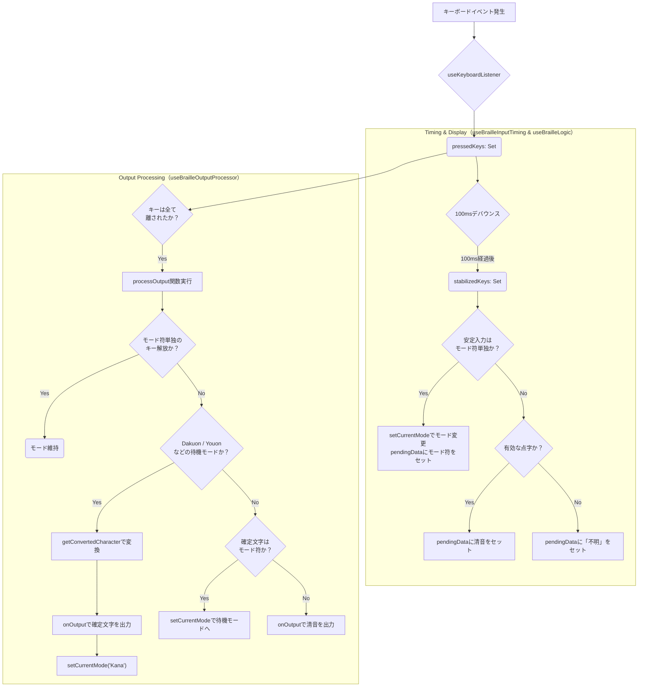

# 👆 指点字練習アプリ (Finger Braille Training App)

このプロジェクトは、Web ブラウザ上で**指点字（六点入力）**の練習を可能にするアプリケーションです。ユーザーはパソコンのキーボードを使って点字を入力し、対応するひらがな、点字、および点の番号をリアルタイムで確認できます。

## 🌟 主な機能

- **キーボード入力対応**: `F`, `D`, `S`, `J`, `K`, `L` キーを使った指点字入力に対応しています。
- **リアルタイム変換**: 押された点の組み合わせに基づき、対応する文字を即座に表示します。
- **全仮名対応**: 全仮名対応: 清音、濁音、半濁音、拗音、拗濁音、拗半濁音 の入力と変換に対応しています。
- **連符対応の拡張中**: 数符、英語などの連符（複数の点字ブロックの組み合わせ）の入力と状態管理機能を開発中です。
- **クリーンな UI**: 入力結果と現在の入力モードを分かりやすく表示します。

## 🚀 使い方

### 1. アプリへのアクセス

ある程度形になったら、Github Pages や、Vercel などで公開します

### 2. 入力方法 (指点字キーアサイン)

以下のキーを同時に押すことで、点字の点を入力します。

| 指点字の点            | 左手 (`FDS`) | 右手 (`JKL`) |
| :-------------------- | :----------- | :----------- |
| **上段 (1 点, 4 点)** | F (1 点)     | J (4 点)     |
| **中段 (2 点, 5 点)** | D (2 点)     | K (5 点)     |
| **下段 (3 点, 6 点)** | S (3 点)     | L (6 点)     |

例:

- **「あ」** (1 点): `F`キーを押す
- **「い」** (1, 2 点): `F`と`D`キーを同時に押す
- **「ん」** (3, 5, 6 点): `S`, `K`, `L`キーを同時に押す
- **「ざ」** (5 点): `K`キーを押下したのち、(1, 5, 6 点): `F`, `K`, `L`キーを同時に押す
- **「にょ」** (4点): `J`キーを押下したのち、(2, 3, 4 点): `D`, `S`, `J`キーを同時に押す
- **「ぎゅ」** (4、5 点): `J`, `K`キーを押下したのち、(1, 4, 6 点): `F`, `J`, `l`キーを同時に押す
- **「ぴゃ」** (4、6 点): `J`, `l`キーを押下したのち、(1, 3, 6 点): `F`, `S`, `L`キーを同時に押す

## 💻 技術スタック

このプロジェクトは、以下の技術とライブラリを使用して構築されています。

- **フロントエンド**: React (Vite / Astro の環境で動作)
- **言語**: TypeScript
- **状態管理/ロジック**: React Hooks (`useBrailleLogic.ts` などカスタムフック中心)
- **スタイリング**: CSS Modules
- **パッケージ管理**: npm / yarn

## 🛠️ 開発環境のセットアップ

ローカルで開発を行うには、以下の手順に従ってください。

1.  **リポジトリのクローン**
    ```bash
    git clone [https://github.com/yuu5733/finger-braille-app.git](https://github.com/yuu5733/finger-braille-app.git)
    cd my-braille-app
    ```
2.  **依存関係のインストール**
    ```bash
    npm install
    # または
    yarn install
    ```
3.  **開発サーバーの起動**
    ```bash
    npm run dev
    # または
    yarn dev
    ```
    ブラウザで `http://localhost:XXXX` にアクセスするとアプリが確認できます。

## 🗺️ 今後の展望

- 英数字モードの完全対応：`数符`、`外字符`（英数・記号）モードへの推移と変換ロジックの実装。
- 練習モードやゲームモードの追加。
- ログイン機能（メール[パスワードはハッシュ化して保存]、Google 連携）
  - Auth0 なども使ってみるのも良いかも
- 成績の記録
- モバイルデバイスでも使えるようにする。
- アクセシビリティの改善（スクリーンリーダーのキーボードショートカットとバッティングする恐れがある）

## 📄 ライセンス

[ライセンスを記載予定 (例: MIT License)]

## 🧠 入力ロジックの概要 (`useBrailleLogic` および関連フック)

点字入力のコアロジックは、キーボードの**生の入力**と、変換後の**出力**を分離することで、堅牢なモード推移を実現しています。

| モジュール | 役割 |
| --- | --- |
| `useKeyboardListener` | キーボードからの生のキー押下 (`pressedKeys`) を取得する。 |
| `useBrailleInputTiming` | キー押下をデバウンスし、**安定した入力** (`stabilizedKeys`) と **キー解放** (`isKeysReleased`) の状態を生成する。 |
| `useBrailleLogic` | `stabilizedKeys` を受け取り、表示すべき文字（`pendingData`）を計算し、モード変更のトリガーを行う。**（表示のロジック）** |
| `useBrailleOutputProcessor` | `isKeysReleased` のタイミングで `pendingData` を受け取り、**現在のモードに基づいて最終的な文字を確定・出力する。** **（確定のロジック）** |

### コアロジックのフローチャート（`refactor/input-logic`）

> 注釈: このフローチャートは、濁音モード（Dakuon）を例とした、キー押下から文字確定までの基本的な流れを示します。拗音、半濁音などのモードも同様のロジックで動作します。

フロチャート

