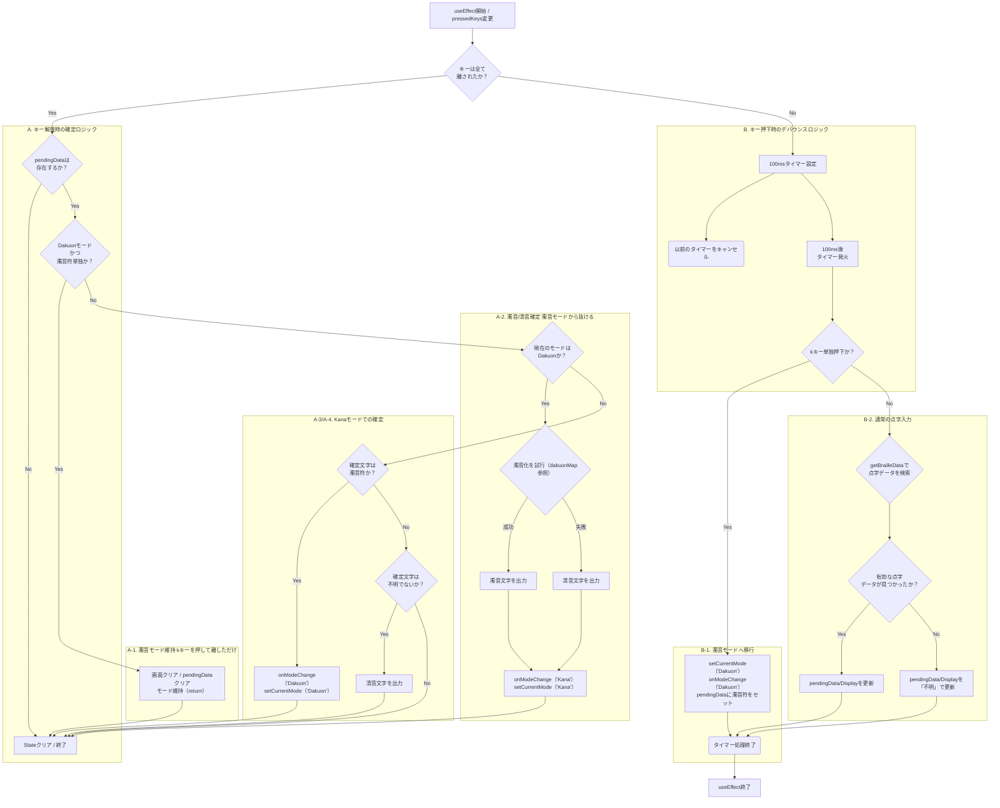

# 👆 指点字練習アプリ (Finger Braille Training App)

このプロジェクトは、Web ブラウザ上で**指点字（六点入力）**の練習を可能にするアプリケーションです。ユーザーはパソコンのキーボードを使って点字を入力し、対応するひらがな、点字、および点の番号をリアルタイムで確認できます。

## 🌟 主な機能

- **キーボード入力対応**: `F`, `D`, `S`, `J`, `K`, `L` キーを使った指点字入力に対応しています。
- **リアルタイム変換**: 押された点の組み合わせに基づき、対応するひらがな、カタカナ、数字、記号、点字を即座に表示します。現在は清音、濁音のみ。
- **連符対応の拡張中**: 拗音、数符などの連符（複数の点字ブロックの組み合わせ）の入力と状態管理機能を開発中です。
- **クリーンな UI**: 入力結果と現在の入力モードを分かりやすく表示します。

## 🚀 使い方

### 1. アプリへのアクセス

ある程度形になったら、Github Pages や、Vercel などで公開します

### 2. 入力方法 (指点字キーアサイン)

以下のキーを同時に押すことで、点字の点を入力します。

| 指点字の点            | 左手 (`FDS`) | 右手 (`JKL`) |
| :-------------------- | :----------- | :----------- |
| **上段 (1 点, 4 点)** | F (1 点)     | J (4 点)     |
| **中段 (2 点, 5 点)** | D (2 点)     | K (5 点)     |
| **下段 (3 点, 6 点)** | S (3 点)     | L (6 点)     |

例:

- **「あ」** (1 点): `F`キーを押す
- **「い」** (1, 2 点): `F`と`D`キーを同時に押す
- **「ん」** (3, 5, 6 点): `S`, `K`, `L`キーを同時に押す
- **「ざ」** (5 点): `K`キーを押下したのち、(1, 5, 6 点): `F`, `K`, `L`キーを同時に押す

## 💻 技術スタック

このプロジェクトは、以下の技術とライブラリを使用して構築されています。

- **フロントエンド**: React (Vite / Astro の環境で動作)
- **言語**: TypeScript
- **スタイリング**: CSS Modules
- **パッケージ管理**: npm / yarn

## 🛠️ 開発環境のセットアップ

ローカルで開発を行うには、以下の手順に従ってください。

1.  **リポジトリのクローン**
    ```bash
    git clone [https://github.com/yuu5733/my-braille-app.git](https://github.com/yuu5733/my-braille-app.git)
    cd my-braille-app
    ```
2.  **依存関係のインストール**
    ```bash
    npm install
    # または
    yarn install
    ```
3.  **開発サーバーの起動**
    ```bash
    npm run dev
    # または
    yarn dev
    ```
    ブラウザで `http://localhost:XXXX` にアクセスするとアプリが確認できます。

## 🗺️ 今後の展望

- 拗音、長音、促音などの連符の完全対応。
- 練習モードやゲームモードの追加。
- ログイン機能（メール[パスワードはハッシュ化して保存]、Google 連携）
  - Auth0 なども使えそうなら
- 成績の記録
- モバイルデバイスでも使えるようにする。
- アクセシビリティの改善（スクリーンリーダーのキーボードショートカットとバッティングする恐れがある）

## 📄 ライセンス

[ライセンスを記載予定 (例: MIT License)]

## ロジック部分

### useBrailleLogic.ts


